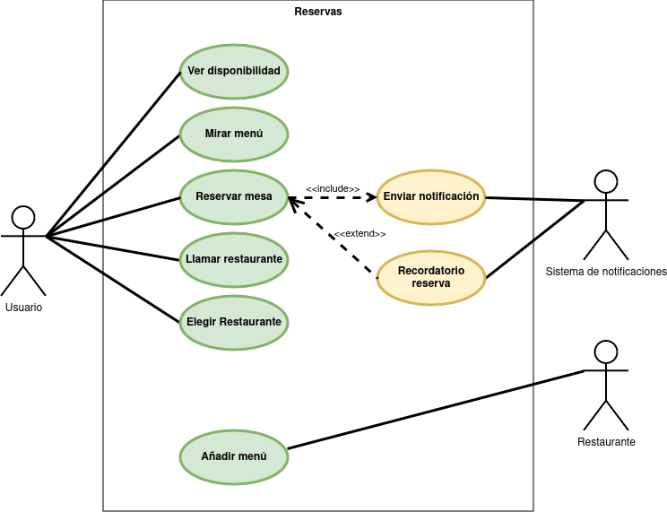

# Reservas Restaurante
## Descripción del proyecto
La idea princial es lograr que los clientes de un restaurante puedan reservar la mesa que desean dentro de las horas disponibles, en caso de que la mesa no esté disponible a la hora deseada no se podrá seleccionar, además los restaurantes tendrán la posibilidad de añadir su carta a la aplicación para que los clientes puedan consultarla desde la misma.

Las funcionalidades principales son:

- El usuario puede crear una cuenta de usuario, para esto debe ingresar un nombre de usuario, una contraseña y un email.

- El usuario puede ingresar a la aplicación con su cuenta de usuario, para esto debe ingresar su nombre de usuario y su contraseña.

- El usuario puede ver las mesas disponibles y reservarlas en un restaurante, para esto debe seleccionar un restaurante y una fecha y hora.

- El usuario puede ver su historial de reservas, para esto debe ingresar a su cuenta de usuario.

- El usuario puede eliminar una reserva, para esto debe seleccionar una reserva y presionar el botón de eliminar.

- El usuario puede ver la carta de un restaurante, para esto debe seleccionar un restaurante.

## Diagrama de Casos de Uso de la biblioteca

## Especificaicón de Casos de uso de las reservas

## Actores
|  Actor | Usuario  |
|---|---|
| Descripción  | Cliente  del restaurante  |
| Características  |  |
| Relaciones | Ver disponibilidad, mirar menú, reservar mesa, llamar restaurante, elegir restaurante |
| Referencias |  |   
|  Notas |   |
| Autor  | Álvaro García López |
|Fecha | 29/10/2024 |

|  Atributo |||
|---|---|---|
| _Nombre_  | _Descripción_  | _Tipo_ |
| | |

|  Actor | Restaurante |
|---|---|
| Descripción  | Representante del restaurante |
| Características  |  |
| Relaciones | Añadir menú |
| Referencias |  |   
|  Notas |   |
| Autor  | Álvaro García López |
|Fecha | 29/10/2024 |

|  Atributo |||
|---|---|---|
| _Nombre_  | _Descripción_  | _Tipo_ |
| | |

|  Actor | Sistema de notificiación |
|---|---|
| Descripción  | Sistema de notificaion de las reservas |
| Características  |  |
| Relaciones | Enviar notificaciones, recordatorio de reserva |
| Referencias |  |   
|  Notas |   |
| Autor  | Álvaro García López |
|Fecha | 29/10/2024 |

|  Atributo |||
|---|---|---|
| _Nombre_  | _Descripción_  | _Tipo_ |
| | |

## Casos de uso

|  Caso de Uso	CU.1 | Ver disponibilidad  |
  |---|---|
  | Fuentes  | Este documento  |
  | Actor  |  Usuario |
  | Descripción | Consultar la disponibilidad de las reservas  |
  | Flujo básico | Ver disponibilidad - Realizar reserva |
  | Pre-condiciones | Nada  |  
  | Post-condiciones  | Realizar la reserva  |  
  |  Requerimientos | No hay |
  |  Notas |  No hay |
  | Autor  | Alvaro Garcia Lopez |
  | Fecha | 05/11/2024 |

  |  Caso de Uso	CU.2 | Mirar menú  |
  |---|---|
  | Fuentes  | Este documento  |
  | Actor  |  Usuario |
  | Descripción | Ver el menú del restaurante  |
  | Flujo básico | Mirar menú - Ver disponibilidad - Realizar reserva |
  | Pre-condiciones | Nada |  
  | Post-condiciones  | Ver disponibilidad  |  
  |  Requerimientos | No hay |
  |  Notas |  No hay |
  | Autor  | Alvaro Garcia Lopez |
  | Fecha | 05/11/2024 |

  |  Caso de Uso	CU.3 | Reservar mesa  |
  |---|---|
  | Fuentes  | Este documento  |
  | Actor  |  Usuario |
  | Descripción | Realizar la reserva de una mesa del restaurante  |
  | Flujo básico | Realizar reserva |
  | Pre-condiciones | Ver disponibilidad  |  
  | Post-condiciones  | Realizar la reserva  |  
  |  Requerimientos | Estar resgistrado y que haya disponibilidad |
  |  Notas |  No hay |
  | Autor  | Alvaro Garcia Lopez |
  | Fecha | 05/11/2024 |

  |  Caso de Uso	CU.4 | Llamar al restaurante  |
  |---|---|
  | Fuentes  | Este documento  |
  | Actor  |  Usuario |
  | Descripción | Llamar al restaurante  |
  | Flujo básico | Llamar al restaurante |
  | Pre-condiciones | Nada  |  
  | Post-condiciones  | Nada  |  
  |  Requerimientos | No hay |
  |  Notas |  No hay |
  | Autor  | Alvaro Garcia Lopez |
  | Fecha | 05/11/2024 |

  |  Caso de Uso	CU.5 |  Elegir restaurante  |
  |---|---|
  | Fuentes  | Este documento  |
  | Actor  |  Usuario |
  | Descripción | Elegir entre los diferentes restaurantes que hay en la app  |
  | Flujo básico | Elegir restaurante |
  | Pre-condiciones | Nada  |  
  | Post-condiciones  | Nada  |  
  |  Requerimientos | No hay |
  |  Notas |  No hay |
  | Autor  | Alvaro Garcia Lopez |
  | Fecha | 05/11/2024 |

  |  Caso de Uso	CU.1 | Añadir el menú  |
  |---|---|
  | Fuentes  | Este documento  |
  | Actor  |  Restaurante |
  | Descripción | Añadir el menú del restaurante  |
  | Flujo básico | Añadir restaurante |
  | Pre-condiciones | Nada  |  
  | Post-condiciones  | Nada  |  
  |  Requerimientos | Estar dado de alta como restaurante |
  |  Notas |  No hay |
  | Autor  | Alvaro Garcia Lopez |
  | Fecha | 05/11/2024 |

  ## Actores
  - **Usuario**: 
    - Persona que utiliza la aplicación para buscar restaurantes y realizar reservas.
  - **Restaurante**: 
    - Propietario que utiliza la aplicación para añadir su restaurante y gestionar sus reservas.
  - **Administrador**: 
    - Usuario encarado de gestionar la app y resolver incidencias.

  ## Operaciones que pueden realizar
  **Usuario**: Iniciar sesión, realizar pagos, modificar perfil, mensualidad de pago con descuentos y realizar reservas.

  **Restaurante**: Añadir menú, modificar menú, eliminar menú, ver reservas realizadas y modificar reservas.

  **Administrador**: Ver estadísticas de ventas, ver estadísticas de usuarios, ver informacion de restaurantes,  eliminar restaurantes y eliminar usuarios.